# BitcoinUSTbills - Web3 Treasury Bills Trading Platform

**Making US Treasury Bills accessible to everyone, everywhere - powered by Internet Computer Protocol**

A comprehensive Web3 platform for minting and redeeming OUSG tokens (backed by US Treasury funds) on the Internet Computer Protocol, enabling fractional ownership starting from $0.01. Users deposit ckBTC to mint OUSG tokens, which are 1:1 backed by Ethereum OUSG tokens representing US Treasury Bill investments.

> **⚠️ Important Disclaimer**: OUSG tokens are backed by US Treasury Bills, which are government-issued centralized assets. While our minting/redemption platform operates fully on-chain using Web3 technology, the underlying OUSG tokens on Ethereum are managed by Ondo Finance and backed by centralized US Treasury securities. We provide decentralized access to OUSG tokens through fractional minting on Internet Computer.

---


## 🌟 Why BitcoinUSTbills on ICP is Revolutionary

### **Traditional T-Bill Platforms vs BitcoinUSTbills**

| Feature | Traditional Platforms | Ethereum/Solana | **BitcoinUSTbills (ICP)** |
|---------|---------------------|-----------------|---------------------------|
| **Platform Architecture** | Centralized Systems | Hybrid (On/Off-chain) | ✅ **Fully On-chain Web3 Platform** |
| **Price Data Source** | Manual/Delayed Updates | Off-chain Oracles | ✅ **Ethereum OUSG Contract (Real-time) + Treasury Rates via HTTPS** |
| **Data Storage** | Centralized Databases | External Storage + IPFS | ✅ **Stable Structures - Native Persistence** |
| **User Authentication** | Username/Password | MetaMask + External KYC | ✅ **Internet Identity + Government-backed VCs** |
| **Minimum Investment** | $1,000-10,000 | $100-1,000 | ✅ **$1 - True Fractional Access** |
| **Transaction Costs** | Fixed Trading Fees | User Pays High Gas | ✅ **Reverse Gas Model - Platform Covers** |
| **Settlement Speed** | T+1/T+2 Days | Minutes (with gas) | ✅ **Instant On-chain Settlement** |
| **Global Access** | Geographic Restrictions | Limited Compliance | ✅ **Worldwide via Web3 + Bitcoin Integration** |

> **Note**: The underlying US Treasury Bills remain centralized government assets. Our innovation is in providing **decentralized access, trading, and management** of these traditional financial instruments through Web3 technology.

---

## 🚀 Project Overview

BitcoinUSTbills revolutionizes access to US Treasury Bills (via OUSG tokens) by leveraging Internet Computer's Web3 capabilities:

### **🎯 Core Innovation**
- **Web3 OUSG Platform**: Fully on-chain minting/redemption infrastructure for OUSG tokens
- **Fractional Tokenization**: Mint OUSG tokens (backed by US Treasury funds) starting from $0.01
- **Real-time Integration**: OUSG price from Ethereum contract + BTC price via XRC canister
- **Government-backed KYC**: Free KYC system with IC Verifiable Credentials (future: government APIs)
- **Bitcoin-backed Access**: Global reach through ckBTC deposits
- **Zero Platform Dependencies**: No external databases or services needed

### **💡 What's Decentralized vs Centralized**

#### **🔴 Centralized Components (Traditional Finance)**
- **US Treasury Bills**: Government-issued securities (inherently centralized)
- **Price Data**: Federal Reserve rates and market data
- **Regulatory Compliance**: SEC and banking regulations
- **Custodian Holdings**: Licensed entities holding physical T-Bills

#### **🟢 Decentralized Components (Our Web3 Innovation)**
- **Minting/Redemption Platform**: Fully on-chain using ICP canisters
- **Token Custody**: User-controlled wallets via Internet Identity (ICRC-1 standard)
- **OUSG Token Operations**: Decentralized minting and redemption
- **Yield Distribution**: Automatic price-based yield (price appreciation model)
- **Data Storage**: Persistent on-chain storage (Stable Structures)
- **User Authentication**: Self-sovereign identity management with government-backed verification

### **🎯 The Bridge: TradFi ↔ DeFi**
BitcoinUSTbills serves as a **bridge between traditional finance and DeFi**, bringing the stability of government securities to the accessibility and innovation of Web3.

---

## 🏗️ Architecture - Hybrid TradFi-DeFi Solution

### **Multi-Canister Web3 Architecture**
```
┌─────────────────┐    ┌─────────────────┐    ┌─────────────────┐
│  Ethereum OUSG  │───▶│   EVM RPC       │───▶│   Backend       │
│   Contract      │    │   Canister      │    │   Canister      │
│ [CENTRALIZED]   │    │ [DECENTRALIZED] │    │ [DECENTRALIZED] │
│ 0x1B19C1939...  │    │                 │    │                 │
└─────────────────┘    └─────────────────┘    └─────────────────┘
        │                       │                         │
        │ balanceOf() calls     │ Price fetching          │ Minting Logic
        ▼                       ▼                         ▼
┌─────────────────┐    ┌─────────────────┐    ┌─────────────────┐
│  ckBTC Ledger   │───▶│  OUSG Ledger    │───▶│  OUSG Index     │
│  (Bitcoin)      │    │  (ICRC-1)       │    │  (Transactions) │
│ [DECENTRALIZED] │    │ [DECENTRALIZED] │    │ [DECENTRALIZED] │
└─────────────────┘    └─────────────────┘    └─────────────────┘
        │                       │                         │
        │ User deposits         │ OUSG tokens             │ History
        ▼                       ▼                         ▼
┌─────────────────┐    ┌─────────────────┐    ┌─────────────────┐
│  File Store     │◀───│  Internet       │───▶│   Frontend      │
│  Bucket (KYC)   │    │  Identity       │    │   (Svelte)      │
│ [DECENTRALIZED] │    │ [DECENTRALIZED] │    │ [DECENTRALIZED] │
└─────────────────┘    └─────────────────┘    └─────────────────┘
        ▲                       ▲                         ▲
        │                       │                         │
┌─────────────────────────────────────────────────────────────────┐
│                    Users (via Internet Identity)                │
│         Deposit ckBTC → Mint OUSG → Earn Yield → Redeem         │
└─────────────────────────────────────────────────────────────────┘
        ▲
        │ Backed by Ethereum OUSG tokens (held by Ondo Finance)
        ▼
┌─────────────────────────────────────────────────────────────────┐
│          Ethereum OUSG Tokens (Backed by US Treasury Funds)     │
│                        [CENTRALIZED ASSET]                      │
└─────────────────────────────────────────────────────────────────┘
```

### **Hybrid Architecture Benefits**
- **🔴 Centralized Asset Backing**: Ethereum OUSG tokens backed by real US Treasury funds (via Ondo Finance)
- **🟢 Decentralized Minting/Redemption**: 24/7 OUSG token operations on Internet Computer
- **🟢 Self-Custody**: Users control their ICRC-1 OUSG tokens via Web3 wallets
- **🟢 Transparent Operations**: All transactions visible on blockchain
- **🟢 Global Access**: No geographic restrictions - anyone can mint OUSG with ckBTC

### **🔐 KYC & Verifiable Credentials Architecture**

Our platform implements a revolutionary **Government-backed KYC system** using Internet Computer's Verifiable Credentials framework, enabling **real document verification** with **cross-dapp credential sharing**.

```mermaid
graph TD
    A["🏛️ Government APIs<br/>(Aadhaar, SSA, etc.)"] --> B["🏗️ KYC Issuer Canister<br/>(WE BUILD THIS)"]
    B --> C["📋 IC VC Standards<br/>(From Repository)"]
    C --> D["🔗 Internet Identity<br/>(Principal Linking)"]
    D --> E["💰 BitcoinUSTbills<br/>(Relying Party)"]
    
    F["👤 User"] --> G["📄 Upload Documents"]
    G --> B
    B --> H["✅ VerifiedAdult VC"]
    H --> D
    D --> I["🔄 Secure Principal Mapping"]
    I --> E
    E --> J["💳 Allow OUSG Minting/Trading"]
    
    style A fill:#ffcccc
    style B fill:#ccffcc
    style C fill:#ccccff
    style E fill:#ffffcc
```



#### **🚀 KYC Innovation Highlights** (Current: Free KYC System)
- **Current Implementation**: Free KYC with document upload and admin review
- **Future Enhancement**: Direct API connections to Aadhaar (India), SSA (US), HMRC (UK)
- **Cross-Dapp Verification**: IC VC standards ready for cross-platform verification
- **Privacy-Preserving**: Documents stored securely, only status shared
- **Admin Review**: Manual review process ensures quality verification
- **Regulatory Compliant**: KYC system meets financial regulations

**Note**: Government API integration is planned for future releases. Current system uses manual admin review.

#### **🔄 Verification Flow** (Current Implementation: Free KYC)
1. **Document Upload**: User uploads government ID (passport, driver's license, etc.)
2. **Document Storage**: Documents stored in File Store Bucket canister
3. **Admin Review**: Admin reviews documents and approves/rejects (manual process)
4. **Status Update**: User KYC status updated (PendingReview → Verified/Rejected)
5. **Trading Enabled**: Instant access to OUSG minting/redemption with verified status

**Future Enhancement**: Direct government API integration for automated verification

> **Technical Advantage**: Unlike traditional platforms requiring separate KYC for each service, our IC VC integration allows **one verification, universal access** across the entire Internet Computer ecosystem.

---

## 📊 Core Data Structures

### **User (Internet Identity Integration)**
```rust
#[derive(CandidType, Deserialize, Clone)]
pub struct User {
    pub principal: Principal,          // Internet Identity Principal
    pub email: String,
    pub kyc_status: KYCStatus,         // Via Verifiable Credentials
    pub wallet_balance: u64,           // In cents
    pub total_invested: u64,           // Total amount invested
    pub total_yield_earned: u64,       // Total yield earned
    pub created_at: u64,
    pub updated_at: u64,
    pub is_active: bool,
    
    // VC enhancements
    pub vc_credentials_ref: Option<String>,
    pub verified_adult: bool,
    pub verified_resident: bool,
    pub kyc_tier: u8,                  // 0=None, 1=Basic, 2=Enhanced, 3=Premium
    pub max_investment_limit: u64,
}
```

### **Deposit (ckBTC to OUSG Minting)**
```rust
#[derive(CandidType, Deserialize, Clone)]
pub struct Deposit {
    pub id: u64,
    pub user_principal: Principal,
    pub ckbtc_amount: u64,        // Deposit amount in ckBTC (8 decimals)
    pub usd_value: f64,           // USD value of the deposit
    pub btc_price_usd: f64,       // BTC price at time of deposit
    pub deposit_time: u64,       // Timestamp
    pub block_index: u64,        // ckBTC block index
    pub status: DepositStatus,    // Pending, Validated, Failed, Processed
    pub ousg_minted: u64,         // Amount of OUSG tokens minted (18 decimals)
}
```

### **User Holding (For Yield Tracking)**
```rust
#[derive(CandidType, Deserialize, Clone)]
pub struct UserHolding {
    pub user_principal: Principal,
    pub ousg_tokens: u64,             // In 18 decimals
    pub purchase_price: f64,          // OUSG price when purchased
    pub purchase_date: u64,           // Timestamp
    pub initial_investment_usd: f64,  // USD value at purchase
}
```

**Note:** The platform currently focuses on **OUSG token minting/redemption** rather than direct T-Bill trading. OUSG tokens are 1:1 backed by Ethereum OUSG tokens, which represent US Treasury Bill funds.

---

## 🔧 Quick Start

### **Installation**
```bash
# Clone the repository
git clone https://github.com/IC-DAPPS/BitcoinUSTbills
cd bitcoinustbills

# Install dependencies
cargo build
dfx start --background

# Deploy locally
dfx deploy
```

### **Basic Usage**
```typescript
// Register user
await backend.register_user({
    email: "user@example.com",
    country: "US",
    phone_number: null
});

// Deposit ckBTC and mint OUSG tokens
await backend.notify_deposit({
    ckbtc_amount: 50000000,  // 0.5 ckBTC (8 decimals)
    block_index: 12345       // ckBTC transaction block
});

// Check OUSG balance
const balance = await backend.get_ousg_balance();

// Get yield information
const yieldInfo = await backend.get_user_yield_info();

// Redeem OUSG for ckBTC
await backend.redeem_ousg_tokens(ousg_amount);
```

### **API Overview**
- `register_user()` - Register with Internet Identity
- `notify_deposit()` - Deposit ckBTC and mint OUSG tokens
- `get_ousg_balance()` - Get user's OUSG token balance
- `get_user_yield_info()` - Get yield earned and portfolio value
- `redeem_ousg_tokens()` - Redeem OUSG tokens for ckBTC
- `get_user_deposits()` - View deposit history
- `calculate_ousg_for_usd()` - Calculate OUSG tokens for USD amount

---

## 🎯 Competitive Advantages on ICP

### **1. Hybrid TradFi-DeFi Architecture**
```diff
- Traditional: Fully centralized systems with limited access
- Other Blockchains: Complex off-chain dependencies
+ BitcoinUSTbills: Web3 platform for traditional assets with real government backing
```

### **2. Real-time OUSG Integration**
```diff
- Other Platforms: Manual price updates, delayed settlements
- DeFi Protocols: Synthetic assets without real backing
+ BitcoinUSTbills: Ethereum OUSG contract (real-time) + 1:1 backed by US Treasury funds
```

### **3. Native Web3 Identity & Compliance**
```diff
- Traditional: Complex KYC processes, weeks of verification
- Competitors: Third-party KYC services ($50-200 per verification)
+ BitcoinUSTbills: Internet Identity + Verifiable Credentials (Instant & Free)
```

### **4. True Fractional Access with OUSG Backing**
```diff
- Traditional Platforms: $1,000+ minimum, complex paperwork
- DeFi Platforms: $100+ with high gas fees, synthetic exposure
+ BitcoinUSTbills: $0.01 minimum, OUSG tokens backed by US Treasury funds, platform covers fees
```

### **5. Global Bitcoin-backed Access**
```diff
- Fiat-based: Geographic restrictions, banking limitations
- Crypto-based: No real asset backing, high volatility
+ BitcoinUSTbills: Global access via ckBTC + US government security backing
```

### **6. Transparent Hybrid Model**
```diff
- Traditional: Black box operations, hidden fees
- Pure DeFi: No real-world asset connection
+ BitcoinUSTbills: Transparent Web3 operations + Real government asset backing
```

---

## 💰 Economic Model & Token Flow

### **Payment Method**
Currently supports **ckBTC (Bitcoin on ICP)** for deposits:
- Users deposit ckBTC (Bitcoin-backed, 8 decimals)
- System calculates USD value using BTC price from XRC canister
- OUSG tokens minted based on current OUSG price (~$113.13)
- Minimum deposit: $5,000 USD worth (configurable, will be reduced to $0.01)

### **Token Flow**
```
1. User Deposits: ckBTC → Backend Canister
2. USD Calculation: ckBTC × BTC_price = USD_value
3. OUSG Calculation: USD_value ÷ OUSG_price = OUSG_tokens
4. Validation: Check Ethereum balance ≥ IC_supply + requested
5. Minting: ICRC-1 OUSG tokens to user account
6. Yield Accrual: OUSG price increases daily → User value increases
7. Redemption: OUSG → ckBTC (at current price with yield)
```

### **Yield Distribution**
- **Model**: Price appreciation (OUSG price increases daily)
- **Frequency**: Daily updates (business days, 4-6pm ET)
- **Distribution**: Automatic - all holders benefit proportionally
- **No Fees**: Currently no platform fees (may be added later)

### **Current Configuration**
```rust
// Minimum deposit (will be reduced)
const MINIMUM_DEPOSIT_USD: f64 = 5000.0; // $5,000 USD

// OUSG token decimals (must match Ethereum)
const OUSG_DECIMALS: u8 = 18;

// OUSG Ethereum contract
const OUSG_CONTRACT: &str = "0x1B19C19393e2d034D8Ff31ff34c81252FcBbee92";
```

---

## 🧭 Operational Note: Manual Replenishment/Top-up

- **What**: Replenishing the canister-controlled Ethereum address (e.g., OUSD) is done **manually** by the ops team.
- **When**: After previously purchased funds (e.g., $5,000) are fully distributed/minted and the balance is low.
- **How**: Manually buy and transfer additional tokens to the **same canister-controlled Ethereum address**. No code/config changes needed.
- **Effect**: The backend continues the same minting flow; it reads the updated token balance and mints equivalent ICRC supply to user accounts as usual.
- **Precision**: Keep ICRC token decimals aligned with the source Ethereum token decimals to avoid rounding/valuation mismatches.

---

## 💰 OUSG Token Minting & Balance Validation System

### **Overview**
Our platform mints ICRC-1 tokens (OUSG) on Internet Computer that are **1:1 backed** by real OUSG tokens held on Ethereum. This ensures every IC token has backing, maintaining trust and financial integrity.

### **Key Concepts**

#### **1. Fractional Minting Advantage**
Unlike traditional platforms like Ondo Finance (minimum ~$5,000 investment), our platform supports **fractional minting**:
- **Minimum investment**: $0.01 USD (vs Ondo's $5,000+)
- **Precision**: 18 decimals (same as Ethereum ERC-20 standard)
- **Example**: User can mint 0.00001 OUSG (worth ~$0.001) if desired

**Why This Matters:**
- Makes US Treasury Bills accessible to everyone
- True fractional ownership from $1, not $5,000
- Democratizes access to traditional finance

#### **2. 1:1 Backing Guarantee**
Every ICRC-1 OUSG token minted is backed by exactly 1 OUSG token on Ethereum:

```
Ethereum Balance: 44.20 OUSG
IC Total Supply:  44.20 OUSG
✅ Perfect 1:1 match = Fully backed
```

**Validation Check (Before Every Mint):**
```
if (IC_total_supply + requested_amount) <= Ethereum_balance {
    ✅ Safe to mint
} else {
    ❌ Reject: "Insufficient OUSG reserve"
}
```

#### **3. Real-Time Minting Flow**

```
1. User deposits ckBTC
   ↓
2. System calculates USD value of deposit
   ↓
3. System fetches current OUSG price (~$113.13)
   ↓
4. Calculate OUSG tokens to mint: USD_value ÷ OUSG_price
   ↓
5. ✅ VALIDATE: Check Ethereum balance + IC supply
   ↓
6. If validated → Mint ICRC-1 tokens immediately (real-time)
   ↓
7. Update IC total supply
```

**Example Calculation:**
- User deposits: $100 USD worth of ckBTC
- OUSG price: $113.13 per token
- Tokens to mint: $100 ÷ $113.13 = **0.884 OUSG**
- System checks: Does Ethereum have at least 0.884 OUSG available?
- If yes → Mint 0.884 OUSG ICRC-1 tokens to user

#### **4. Balance Validation Examples**

**Scenario 1: Normal Minting**
```
Initial State:
- Ethereum balance: 44.20 OUSG
- IC total supply: 0 OUSG

User Request: 10 OUSG
Validation: 0 + 10 <= 44.20? ✅ YES
Result: Mint 10 OUSG, IC supply = 10 OUSG
```

**Scenario 2: Insufficient Reserve**
```
Current State:
- Ethereum balance: 44.20 OUSG
- IC total supply: 42 OUSG
- Available: 2.20 OUSG

User Request: 5 OUSG
Validation: 42 + 5 <= 44.20? ❌ NO (47 > 44.20)
Result: Reject with error: "Only 2.20 OUSG available, 5.00 requested"
```

**Scenario 3: Fractional Precision (18 Decimals)**
```
Ethereum: 44.20 OUSG (44200000000000000000 units)
IC Supply: 44.19 OUSG (44190000000000000000 units)
Available: 0.01 OUSG (10000000000000000 units)

User Request: 0.01 OUSG
Validation: 44190000000000000000 + 10000000000000000 <= 44200000000000000000? ✅ YES
Result: Mint 0.01 OUSG (exact match)
```

#### **5. Replenishment Thresholds & Alerts**

The system monitors OUSG reserve usage and alerts when replenishment is needed:

| Threshold | Usage Level | Action | Status |
|-----------|-------------|--------|--------|
| **90%** | 39.78 OUSG used (out of 44.20) | ⚠️ Warning alert to admin | Continue minting |
| **95%** | 41.99 OUSG used | 🔴 Critical alert | Continue minting |
| **99%** | 43.76 OUSG used | 🚫 Block new mints | Require replenishment |
| **100%** | 44.20 OUSG used | ❌ All mints blocked | Manual top-up required |

**Why Thresholds Matter:**
- **90%**: Gives admin time to prepare replenishment
- **95%**: Urgent action needed
- **99%**: Prevents over-minting (safety buffer)

#### **6. Rounding Buffer**

To handle precision differences, a small buffer is used:
- **Buffer size**: 0.000000001 OUSG (1 billionth of a token)
- **Purpose**: Prevents false rejections due to rounding errors
- **Impact**: Minimal (~$0.000001 in value)

**Example with Buffer:**
```
Ethereum: 44.200000000000000001 OUSG (rounding artifact)
IC: 44.200000000000000000 OUSG
Buffer: 0.000000001 OUSG

Check: IC + requested + buffer <= Ethereum? ✅ YES
(Prevents rejection due to tiny rounding differences)
```

#### **7. OUSG Token Details**

- **Ethereum Contract**: `0x1B19C19393e2d034D8Ff31ff34c81252FcBbee92`
- **Standard**: ERC-20
- **Decimals**: 18 (1 token = 10^18 units)
- **Current Price**: ~$113.13 USD (fluctuates)
- **Etherscan**: https://etherscan.io/token/0x1B19C19393e2d034D8Ff31ff34c81252FcBbee92

**Balance Check:**
- Function: `balanceOf(address)` 
- Returns: Balance in 18 decimal precision
- Example: `44200000000000000000` = 44.20 OUSG tokens

#### **8. Comparison: BitcoinUSTbills vs Ondo Finance**

| Feature | Ondo Finance | **BitcoinUSTbills** |
|---------|--------------|---------------------|
| **Minimum Investment** | ~$5,000 USD | ✅ **$0.01 USD** |
| **Fractional Tokens** | ❌ No (whole tokens only) | ✅ **Yes (18 decimals)** |
| **Minting Speed** | Manual processing | ✅ **Real-time** |
| **Accessibility** | High-net-worth individuals | ✅ **Everyone** |
| **Backing** | 1:1 with OUSG | ✅ **1:1 with OUSG** |
| **Decentralization** | Partial | ✅ **Fully on-chain** |

### **Technical Implementation**

#### **Balance Validation Code Flow**
```rust
// Before minting in notify_deposit()

1. Get Ethereum balance: get_ousg_ethereum_balance(address)
2. Get IC supply: get_ic_ousg_total_supply()
3. Calculate requested: deposit.calculate_ousg_to_mint()
4. Validate: (IC_supply + requested + buffer) <= Ethereum_balance
5. Check threshold: usage_ratio = (IC_supply + requested) / Ethereum_balance
6. If threshold exceeded: Block or alert
7. If validated: Proceed with minting
```

#### **Key Functions**
- `get_ousg_ethereum_balance()` - Fetches balance via EVM RPC `balanceOf` call
- `get_ic_ousg_total_supply()` - Gets current ICRC-1 ledger total supply
- `can_mint_ousg()` - Validates if minting is allowed
- `notify_admin()` - Sends alerts at threshold levels

### **Benefits for Users**

1. ✅ **True Fractional Access**: Start with $1, not $5,000
2. ✅ **Always Backed**: Every token guaranteed 1:1 with Ethereum OUSG
3. ✅ **Real-Time**: Instant minting, no waiting
4. ✅ **Transparent**: All validations happen on-chain
5. ✅ **Global Access**: No geographic restrictions

### **Benefits for Platform**

1. ✅ **Trust**: Users know tokens are always backed
2. ✅ **Compliance**: Maintains 1:1 backing ratio
3. ✅ **Automated Alerts**: Know when to replenish
4. ✅ **Prevents Over-Minting**: Validation blocks unbacked tokens
5. ✅ **Competitive Advantage**: Fractional access vs competitors

---

## 💰 Yield Distribution System

### **Overview**
OUSG tokens earn yield daily from underlying US Treasury funds. Our platform uses **price appreciation model** (same as Ondo Finance's OUSG) where yield is automatically distributed to all holders proportionally when the token price increases.

### **How Yield Works**

#### **Key Mechanism: Automatic Proportional Distribution**
- **Single price update benefits everyone**: When OUSG price increases from $113.13 to $121.50, ALL holders benefit automatically
- **Proportional yield**: Each user earns yield based on their token holdings
- **No token transfers needed**: Yield is in price appreciation, not separate token distribution
- **Works for any amount**: 0.00001 tokens or 10,000 tokens - same mechanism

#### **Daily Price Update**
```
Every Business Day (4-6pm ET):
1. System fetches OUSG price from Ethereum contract
2. Updates global price tracker
3. All holders automatically benefit from price increase
4. No user iteration or token minting needed!
```

### **Yield Distribution Examples**

#### **Example 1: Multiple Users with Different Holdings**

**Day 1 (Investment):**
```
User A: Deposits $5,000 → Gets 44.20 OUSG @ $113.13
User B: Deposits $100   → Gets 0.884 OUSG @ $113.13
User C: Deposits $1     → Gets 0.00884 OUSG @ $113.13

OUSG Price: $113.13
```

**Day 365 (After 1 Year, Price: $121.50 - 7.4% yield):**
```
User A: 44.20 tokens × $121.50 = $5,370.30
        Yield: +$370.30 (7.4%) ✅

User B: 0.884 tokens × $121.50 = $107.40
        Yield: +$7.40 (7.4%) ✅

User C: 0.00884 tokens × $121.50 = $1.07
        Yield: +$0.07 (7.4%) ✅

All users earned same percentage yield!
Different absolute amounts based on holdings.
```

#### **Example 2: Single User Journey**

**Timeline:**
```
Day 1:   Invest $5,000 → 44.20 tokens @ $113.13 = $5,000
Day 30:  Price → $113.85 → Value: $5,032.17 (+$32.17 yield)
Day 365: Price → $121.50 → Value: $5,370.30 (+$370.30 yield)

User redeems: Gets $5,370.30 worth of ckBTC
Profit realized: $370.30 ✅
```

### **Yield Calculation**

#### **For Each User:**
```
Current Value = Token Balance × Current OUSG Price
Yield Earned = Current Value - Initial Investment
Yield % = (Yield Earned / Initial Investment) × 100
```

#### **APY Calculation (30-Day Rolling Average):**
```
APY = e^((End_NAV - Start_NAV) / (30/365)) - 1

Where:
- End_NAV = Current OUSG price
- Start_NAV = Price 30 days ago
- e = Euler's number (~2.718)
```

### **User Dashboard Display**

Each user sees their yield information in real-time:

```
┌─────────────────────────────────────┐
│ Your OUSG Portfolio                 │
│                                     │
│ Tokens: 44.20 OUSG                 │
│ Current Price: $121.50              │
│                                     │
│ Current Value: $5,370.30            │
│ Initial Investment: $5,000.00       │
│ Yield Earned: +$370.30              │
│ Return: +7.4%                        │
│                                     │
│ APY: 7.4%                           │
│ 7-Day Yield: 0.14%                   │
│ 30-Day Yield: 0.61%                  │
└─────────────────────────────────────┘
```

### **Technical Implementation**

#### **1. Store Holdings (When Minting)**
```rust
// When user mints tokens, store:
UserHolding {
    tokens: 44.20,
    purchase_price: $113.13,
    purchase_date: timestamp,
    initial_investment: $5,000
}
```

#### **2. Daily Price Update (Heartbeat)**
```rust
#[ic_cdk::heartbeat]
pub async fn update_ousg_price_daily() {
    let new_price = fetch_ousg_price_from_ethereum().await?;
    update_global_price(new_price);
    // That's it! All holders benefit automatically
}
```

#### **3. Real-Time Yield Calculation**
```rust
#[query]
pub fn get_user_yield_info() -> UserYieldInfo {
    let tokens = get_user_token_balance();
    let current_price = get_current_ousg_price();
    let current_value = tokens × current_price;
    let yield_earned = current_value - initial_investment;
    
    UserYieldInfo {
        tokens,
        current_price,
        current_value,
        yield_earned,
        yield_percentage: (yield_earned / initial_investment) × 100
    }
}
```

### **Key Features**

1. ✅ **Automatic Distribution**: No manual token transfers - price update benefits everyone
2. ✅ **Proportional Yield**: Same % yield for all, different absolute amounts
3. ✅ **Real-Time Calculation**: Yield calculated on-demand when user queries
4. ✅ **Works for Any Amount**: 0.00001 to 10,000+ tokens supported
5. ✅ **Low Gas Costs**: No daily token minting/transfers needed
6. ✅ **Historical Tracking**: 30+ days price history for APY calculation

### **Comparison: BitcoinUSTbills vs Ondo Finance**

| Feature | Ondo Finance | **BitcoinUSTbills** |
|---------|--------------|---------------------|
| **Yield Model** | Price Appreciation | ✅ **Price Appreciation** |
| **Yield Visibility** | Through price increase | ✅ **Real-time dashboard display** |
| **Fractional Holdings** | ❌ No (whole tokens) | ✅ **Yes (any amount)** |
| **Yield Calculation** | On redemption only | ✅ **Real-time queries** |
| **APY Display** | Website only | ✅ **User dashboard** |

### **Benefits**

**For Users:**
- ✅ See yield earned in real-time
- ✅ Track portfolio value with yield included
- ✅ Understand APY and returns
- ✅ Same percentage yield regardless of holding size

**For Platform:**
- ✅ No complex token distribution logic
- ✅ Low gas costs (no daily transfers)
- ✅ Simple implementation (price tracking)
- ✅ Aligned with Ethereum OUSG model

---

## 🧪 Testing & Quality Assurance

### **Comprehensive Test Coverage**
- ✅ **Unit Tests**: Individual function validation
- ✅ **Integration Tests**: End-to-end workflows  
- ✅ **Security Tests**: Access control and validation
- ✅ **Performance Tests**: Load testing and optimization

### **Test Commands**
```bash
# Run all tests
cargo test

# Run specific test suites
cargo test deposit_tests
cargo test ousg_minting_tests
cargo test kyc_tests

# Run Playwright E2E tests
npm test

# Integration testing
dfx start --background
bash scripts/integration-tests.sh
```

### **Quality Metrics**
- **Code Coverage**: 90%+ target
- **Security Audit**: Regular third-party audits
- **Performance**: Sub-second response times
- **Reliability**: 99.9% uptime target

📊 **[Detailed Test Reports →](https://docs.bitcoinustbills.com/testing)**

---

## 🚀 Deployment & Scaling

### **ICP-Optimized Deployment**
```bash
# Deployment script
#!/bin/bash

echo "🚀 Deploying BitcoinUSTbills on Internet Computer..."

# Start DFX (if not running)
dfx start --background

# Deploy core canisters
dfx deploy backend --with-cycles 5000000000000

# Deploy file store bucket (for KYC document storage)
dfx deploy file_store_bucket

# Deploy OUSG ledger (ICRC-1 token)
./scripts/deploy-local-ousg.sh

# Deploy OUSG index (for transaction history)
dfx deploy ousg_index

# Note: These are remote canisters (already deployed on IC):
# - ckbtc_ledger (Bitcoin ledger)
# - evm_rpc (Ethereum RPC calls)
# - xrc (Exchange rate canister for BTC price)
# - ii (Internet Identity)

echo "✅ Deployment complete! Platform ready."
```

### **Platform Analytics**
```rust
// Current platform metrics (available functions)
#[query]
pub fn get_deposit_stats() -> HashMap<String, u64> {
    // Returns: total_deposits, processed_deposits, pending_deposits
}

#[query]
pub fn get_storage_stats() -> HashMap<String, u64> {
    // Returns: users, deposits, free_kyc_sessions, etc.
}

#[query]
pub fn get_user_profile() -> Result<User> {
    // Returns current user's profile and holdings
}

// Future analytics functions (to be implemented):
// - Total OUSG minted
// - Total ckBTC deposited
// - Average investment size
// - Total yield earned by users
// - APY statistics
```

---

## 🗺️ Enhanced Roadmap

### **Phase 1: Core Platform ✅**
- [x] ICP-native data structures and stable storage
- [x] Internet Identity integration for seamless authentication
- [x] ckBTC deposit and OUSG minting system
- [x] ICRC-1 compliant OUSG token ledger
- [x] OUSG redemption system
- [x] Free KYC system with admin review
- [x] Balance validation system (Ethereum OUSG balance checking)

### **Phase 2: Advanced ICP Features 🔄**
- [x] **Cross-chain Integration**: Native Bitcoin via ckBTC ✅ (implemented)
- [ ] **Ethereum OUSG Balance Checking**: Implement `balanceOf()` function calls
- [ ] **Automated Yield Distribution**: Daily price updates via heartbeat
- [ ] **User Yield Dashboard**: Real-time yield calculation and display
- [ ] **18 Decimals Fix**: Update all calculations to match Ethereum OUSG decimals
- [ ] **Dynamic OUSG Price Fetching**: Replace hardcoded $5000 with real-time price
- [ ] **Government API KYC**: Direct government verification (future)
- [ ] **Mobile App**: React Native with IC Agent integration

### **Phase 3: Global Scale 📈**
- [ ] **Multi-language Support**: Global accessibility
- [ ] **Institutional Features**: Large-scale investment tools
- [ ] **Regulatory Compliance**: Automated reporting via HTTPS
- [ ] **DeFi Integration**: ICPSwap, Sonic, and other DEXs
- [ ] **AI-powered Analytics**: Predictive yield modeling

### **Phase 4: Ecosystem Expansion 🌍**
- [ ] **Corporate Bonds**: Expand beyond T-Bills
- [ ] **International Treasuries**: EU, UK, Japan bonds
- [ ] **Staking Rewards**: Platform token with governance
- [ ] **Institutional APIs**: White-label solutions
- [ ] **Carbon Credits**: Environmental asset tokenization

---

## 🏆 Success Metrics

### **Platform KPIs**
- **User Growth**: Target 10K+ users by end of year
- **OUSG Minted**: Track total OUSG tokens minted on IC
- **Total Deposits**: $1M+ monthly ckBTC deposits
- **Yield Distribution**: 99.9% automated price update uptime
- **Global Reach**: 50+ countries with active users
- **Cost Efficiency**: 90% reduction vs traditional platforms

### **Technical Performance**
- **EVM RPC Calls**: 99.9% success rate for Ethereum OUSG contract calls
- **XRC Price Fetching**: Real-time BTC price for ckBTC valuation
- **Storage Efficiency**: 50% better than other blockchain solutions (Stable Structures)
- **Transaction Speed**: Sub-second minting/redemption times
- **Canister Efficiency**: Optimized cycle consumption

### **Hybrid Model Success**
- **Asset Security**: 100% OUSG backing verification (1:1 with Ethereum OUSG)
- **Regulatory Compliance**: KYC system in place, compliant operations
- **User Trust**: Transparent minting/redemption and yield distribution
- **Market Access**: Breaking down traditional investment barriers ($0.01 minimum vs $5,000)

---

## 📞 Support & Community

### **Community**
- **Discord**: Join our developer community
- **GitHub**: Contribute to open-source development
- **Twitter**: Follow [@BitcoinUSTbills](https://twitter.com/BitcoinUSTbills) for updates
- **Telegram**: Real-time support and announcements

---

**Built with ❤️ on the Internet Computer Protocol**

*Bridging Traditional Finance and Web3 - Making US Treasury Bills accessible to everyone, everywhere through decentralized technology.*

---

## 🔗 Quick Links

- [GitHub Repository](https://github.com/IC-DAPPS/BitcoinUSTbills)

**Ready to bridge TradFi and DeFi? Let's build the future of accessible finance together! 🚀**