# BitcoinUSTbills - Web3 Treasury Bills Trading Platform

**Making US Treasury Bills accessible to everyone, everywhere - powered by Internet Computer Protocol**

A comprehensive Web3 platform for tokenizing and trading US Treasury Bills on the Internet Computer Protocol, enabling fractional ownership starting from $1.

> **⚠️ Important Disclaimer**: US Treasury Bills are government-issued centralized assets. While our trading platform operates fully on-chain using Web3 technology, the underlying T-Bills remain centralized government securities. We provide decentralized access, trading, and management of these traditional financial instruments.

---

## 🌟 Why BitcoinUSTbills on ICP is Revolutionary

### **Traditional T-Bill Platforms vs BitcoinUSTbills**

| Feature | Traditional Platforms | Ethereum/Solana | **BitcoinUSTbills (ICP)** |
|---------|---------------------|-----------------|---------------------------|
| **Platform Architecture** | Centralized Systems | Hybrid (On/Off-chain) | ✅ **Fully On-chain Web3 Platform** |
| **Price Data Source** | Manual/Delayed Updates | Off-chain Oracles | ✅ **Direct Fed API via HTTPS Outcalls** |
| **Data Storage** | Centralized Databases | External Storage + IPFS | ✅ **Stable Structures - Native Persistence** |
| **User Authentication** | Username/Password | MetaMask + External KYC | ✅ **Internet Identity + Government-backed VCs** |
| **Minimum Investment** | $1,000-10,000 | $100-1,000 | ✅ **$1 - True Fractional Access** |
| **Transaction Costs** | Fixed Trading Fees | User Pays High Gas | ✅ **Reverse Gas Model - Platform Covers** |
| **Settlement Speed** | T+1/T+2 Days | Minutes (with gas) | ✅ **Instant On-chain Settlement** |
| **Global Access** | Geographic Restrictions | Limited Compliance | ✅ **Worldwide via Web3 + Bitcoin Integration** |

> **Note**: The underlying US Treasury Bills remain centralized government assets. Our innovation is in providing **decentralized access, trading, and management** of these traditional financial instruments through Web3 technology.

---

## 🚀 Project Overview

BitcoinUSTbills revolutionizes access to US Treasury Bills by leveraging Internet Computer's Web3 capabilities:

### **🎯 Core Innovation**
- **Web3 Trading Platform**: Fully on-chain trading infrastructure for traditional assets
- **Fractional Tokenization**: Convert T-Bills into tradeable digital tokens starting from $1
- **Real-time Integration**: Direct Fed API calls via HTTPS Outcalls for live pricing
- **Government-backed KYC**: Direct government API integration with IC Verifiable Credentials
- **Bitcoin-backed Access**: Global reach through Bitcoin treasury investments
- **Zero Platform Dependencies**: No external databases or services needed

### **💡 What's Decentralized vs Centralized**

#### **🔴 Centralized Components (Traditional Finance)**
- **US Treasury Bills**: Government-issued securities (inherently centralized)
- **Price Data**: Federal Reserve rates and market data
- **Regulatory Compliance**: SEC and banking regulations
- **Custodian Holdings**: Licensed entities holding physical T-Bills

#### **🟢 Decentralized Components (Our Web3 Innovation)**
- **Trading Platform**: Fully on-chain using ICP canisters
- **Token Custody**: User-controlled wallets via Internet Identity
- **Order Matching**: Decentralized exchange functionality
- **Yield Distribution**: Automated smart contract processing
- **Data Storage**: Persistent on-chain storage
- **User Authentication**: Self-sovereign identity management with government-backed verification

### **🎯 The Bridge: TradFi ↔ DeFi**
BitcoinUSTbills serves as a **bridge between traditional finance and DeFi**, bringing the stability of government securities to the accessibility and innovation of Web3.

---

## 🏗️ Architecture - Hybrid TradFi-DeFi Solution

### **Multi-Canister Web3 Architecture**
```
┌─────────────────┐    ┌─────────────────┐    ┌─────────────────┐
│   Treasury API  │───▶│  Price Oracle   │───▶│   USTBills      │
│  (treasury.gov) │    │    Canister     │    │   Canister      │
│  [CENTRALIZED]  │    │ [DECENTRALIZED] │    │ [DECENTRALIZED] │
└─────────────────┘    └─────────────────┘    └─────────────────┘
        │                       │                         │
        │ HTTPS Outcalls        │ Stable Storage          │ ICRC-1 Tokens
        ▼                       ▼                         ▼
┌─────────────────┐    ┌─────────────────┐    ┌─────────────────┐
│  Notification   │◀───│   User KYC      │───▶│    Trading      │
│    Service      │    │   Canister      │    │   Canister      │
│ [DECENTRALIZED] │    │ [DECENTRALIZED] │    │ [DECENTRALIZED] │
└─────────────────┘    └─────────────────┘    └─────────────────┘
        │                       │                         │
        ▼                       ▼                         ▼
┌─────────────────────────────────────────────────────────────────┐
│           Internet Identity + Bitcoin Integration               │
│        [DECENTRALIZED] + ckBTC [BITCOIN-BACKED]               │
└─────────────────────────────────────────────────────────────────┘
        ▲                                                        
        │ Real T-Bills held by Licensed Custodian                
        ▼                                                        
┌─────────────────────────────────────────────────────────────────┐
│                    Physical T-Bills Storage                     │
│                        [CENTRALIZED]                           │
└─────────────────────────────────────────────────────────────────┘
```

### **Hybrid Architecture Benefits**
- **🔴 Centralized Asset Backing**: Real T-Bills provide government-guaranteed security
- **🟢 Decentralized Trading**: 24/7 trading without traditional banking hours
- **🟢 Self-Custody**: Users control their tokens via Web3 wallets
- **🟢 Transparent Operations**: All transactions visible on blockchain
- **🟢 Global Access**: No geographic restrictions for trading

### **🔐 KYC & Verifiable Credentials Architecture**

Our platform implements a revolutionary **Government-backed KYC system** using Internet Computer's Verifiable Credentials framework, enabling **real document verification** with **cross-dapp credential sharing**.

```mermaid
graph TD
    A["🏛️ Government APIs<br/>(Aadhaar, SSA, etc.)"] --> B["🏗️ KYC Issuer Canister<br/>(WE BUILD THIS)"]
    B --> C["📋 IC VC Standards<br/>(From Repository)"]
    C --> D["🔗 Internet Identity<br/>(Principal Linking)"]
    D --> E["💰 BitcoinUSTbills<br/>(Relying Party)"]
    
    F["👤 User"] --> G["📄 Upload Documents"]
    G --> B
    B --> H["✅ VerifiedAdult VC"]
    H --> D
    D --> I["🔄 Secure Principal Mapping"]
    I --> E
    E --> J["💳 Allow T-Bill Trading"]
    
    style A fill:#ffcccc
    style B fill:#ccffcc
    style C fill:#ccccff
    style E fill:#ffffcc
```



#### **🚀 KYC Innovation Highlights**
- **Real Government Integration**: Direct API connections to Aadhaar (India), SSA (US), HMRC (UK)
- **Cross-Dapp Verification**: KYC once, trade everywhere using IC VC standards
- **Privacy-Preserving**: Only share required attributes (age 18+, residency) not personal data
- **Instant Verification**: No waiting periods, immediate trading access after verification
- **Regulatory Compliant**: Government-backed verification meets all financial regulations

#### **🔄 Verification Flow**
1. **Document Upload**: User uploads government ID (passport, Aadhaar, SSN)
2. **Government Verification**: Direct API calls to official government databases
3. **VC Issuance**: Government-backed Verifiable Credential issued
4. **Cross-Platform Access**: Same VC works across all IC dapps
5. **Trading Enabled**: Instant access to T-Bill trading with verified status

> **Technical Advantage**: Unlike traditional platforms requiring separate KYC for each service, our IC VC integration allows **one verification, universal access** across the entire Internet Computer ecosystem.

---

## 📊 Enhanced Data Structures

### **USTBill (Enhanced with ICP Features)**
```rust
#[derive(CandidType, Deserialize, Clone)]
pub struct USTBill {
    pub id: String,
    pub cusip: String,
    pub face_value: u64,        // In cents
    pub purchase_price: u64,    // In cents
    pub maturity_date: u64,     // Unix timestamp
    pub annual_yield: f64,      // Real-time from Fed API
    pub total_tokens: u64,      // ICRC-1 tokenized shares
    pub tokens_sold: u64,       // Real-time tracking
    pub status: USTBillStatus,  // Auto-updated via timers
    
    // ICP-specific enhancements
    pub fed_api_last_update: u64,     // Last price update via HTTPS
    pub icrc1_token_id: String,       // Native token standard
    pub auto_maturity_enabled: bool,  // Timer-based processing
    pub yield_distribution_history: Vec<YieldDistribution>,
}
```

### **User (Internet Identity Integration)**
```rust
#[derive(CandidType, Deserialize, Clone)]
pub struct User {
    pub principal: Principal,          // Internet Identity Principal
    pub ii_anchor: Option<u64>,        // Internet Identity Anchor
    pub email: String,
    pub kyc_status: KYCStatus,         // Via Verifiable Credentials
    pub wallet_balance: u64,           // Native ICP wallet
    pub ckbtc_balance: u64,           // Bitcoin integration
    pub total_invested: u64,
    pub total_yield_earned: u64,
    
    // ICP-specific features
    pub vc_credentials: Vec<String>,   // Verifiable Credentials JWTs
    pub notification_settings: NotificationConfig,
    pub last_fed_sync: u64,           // Auto-sync tracking
}
```

### **Enhanced Token Holding**
```rust
#[derive(CandidType, Deserialize, Clone)]
pub struct TokenHolding {
    pub id: String,
    pub user_principal: Principal,
    pub ustbill_id: String,
    pub tokens_owned: u64,
    pub purchase_price_per_token: u64,
    pub yield_option: YieldOption,
    pub status: HoldingStatus,
    
    // ICP enhancements
    pub icrc1_transfer_history: Vec<TransferRecord>,
    pub auto_reinvest_enabled: bool,
    pub maturity_notification_sent: bool,
    pub yield_claim_history: Vec<YieldClaim>,
}
```

---

## 🔧 Quick Start

### **Installation**
```bash
# Clone the repository
git clone https://github.com/IC-DAPPS/BitcoinUSTbills
cd bitcoinustbills

# Install dependencies
cargo build
dfx start --background

# Deploy locally
dfx deploy
```

### **Basic Usage**
```javascript
// Connect to platform
import { BitcoinUSTbills } from '@bitcoinustbills/sdk';
const client = new BitcoinUSTbills();

// Buy T-Bill tokens
await client.buyTBill({
    cusip: "912796TY5",
    amount: 100, // $1.00
    paymentMethod: "ckBTC"
});

// Check holdings
const holdings = await client.getUserHoldings();
```

### **API Overview**
- `GET /api/ustbills` - List available T-Bills
- `POST /api/trade/buy` - Purchase T-Bill tokens  
- `GET /api/user/holdings` - View user portfolio
- `POST /api/user/register` - Register with Internet Identity

---

## 🎯 Competitive Advantages on ICP

### **1. Hybrid TradFi-DeFi Architecture**
```diff
- Traditional: Fully centralized systems with limited access
- Other Blockchains: Complex off-chain dependencies
+ BitcoinUSTbills: Web3 platform for traditional assets with real government backing
```

### **2. Real-time Treasury Integration**
```diff
- Other Platforms: Manual price updates, delayed settlements
- DeFi Protocols: Synthetic assets without real backing
+ BitcoinUSTbills: Direct treasury.gov API + Real T-Bill custody
```

### **3. Native Web3 Identity & Compliance**
```diff
- Traditional: Complex KYC processes, weeks of verification
- Competitors: Third-party KYC services ($50-200 per verification)
+ BitcoinUSTbills: Internet Identity + Verifiable Credentials (Instant & Free)
```

### **4. True Fractional Access with Government Backing**
```diff
- Traditional Platforms: $1,000+ minimum, complex paperwork
- DeFi Platforms: $100+ with high gas fees, synthetic exposure
+ BitcoinUSTbills: $1 minimum, real T-Bill backing, platform covers fees
```

### **5. Global Bitcoin-backed Access**
```diff
- Fiat-based: Geographic restrictions, banking limitations
- Crypto-based: No real asset backing, high volatility
+ BitcoinUSTbills: Global access via ckBTC + US government security backing
```

### **6. Transparent Hybrid Model**
```diff
- Traditional: Black box operations, hidden fees
- Pure DeFi: No real-world asset connection
+ BitcoinUSTbills: Transparent Web3 operations + Real government asset backing
```

---

## 💰 Enhanced Economic Model

### **Multi-Asset Support**
```rust
pub enum PaymentMethod {
    ICP,           // Native Internet Computer tokens
    ckBTC,         // Bitcoin on ICP (1:1 backed)
    USDC,          // USD Coin via ICRC-1
    ckETH,         // Ethereum on ICP (coming soon)
}

pub struct PlatformConfig {
    pub platform_fee_percentage: f64,     // 0.5%
    pub minimum_investment_usd: u64,       // $1 (100 cents)
    pub maximum_investment_usd: u64,       // $10,000 per transaction
    pub yield_distribution_frequency: u64, // Daily via timers
    pub kyc_expiry_days: u64,             // 365 days
    pub auto_compound_threshold: u64,      // $10 minimum
    pub supported_payment_methods: Vec<PaymentMethod>,
}
```

### **Automated Fee Distribution**
```rust
// Platform fees automatically distributed
#[ic_cdk::heartbeat]
pub async fn distribute_platform_fees() {
    let total_fees = get_accumulated_fees();
    
    if total_fees > 0 {
        // 70% to development fund
        let dev_share = (total_fees * 70) / 100;
        let _ = icrc1_transfer(DEV_WALLET, dev_share).await;
        
        // 20% to platform reserves
        let reserve_share = (total_fees * 20) / 100;
        let _ = icrc1_transfer(RESERVE_WALLET, reserve_share).await;
        
        // 10% to community rewards
        let community_share = total_fees - dev_share - reserve_share;
        let _ = distribute_community_rewards(community_share).await;
    }
}
```

---

## 🧪 Testing & Quality Assurance

### **Comprehensive Test Coverage**
- ✅ **Unit Tests**: Individual function validation
- ✅ **Integration Tests**: End-to-end workflows  
- ✅ **Security Tests**: Access control and validation
- ✅ **Performance Tests**: Load testing and optimization

### **Test Commands**
```bash
# Run all tests
cargo test

# Run specific test suites
cargo test ustbill_tests
cargo test trading_tests
cargo test kyc_tests

# Integration testing
dfx start --background
bash scripts/integration-tests.sh
```

### **Quality Metrics**
- **Code Coverage**: 90%+ target
- **Security Audit**: Regular third-party audits
- **Performance**: Sub-second response times
- **Reliability**: 99.9% uptime target

📊 **[Detailed Test Reports →](https://docs.bitcoinustbills.com/testing)**

---

## 🚀 Deployment & Scaling

### **ICP-Optimized Deployment**
```bash
# Enhanced deployment script
#!/bin/bash

echo "🚀 Deploying BitcoinUSTbills on Internet Computer..."

# Deploy Internet Identity (for KYC)
dfx deploy internet_identity

# Deploy ICRC-1 Ledgers
dfx deploy icrc1_ledger_icp
dfx deploy icrc1_ledger_ckbtc
dfx deploy icrc1_ledger_usdc

# Deploy core canisters with optimized settings
dfx deploy ustbills_backend --with-cycles 10000000000000
dfx deploy user_management --with-cycles 5000000000000
dfx deploy trading_engine --with-cycles 5000000000000
dfx deploy yield_calculator --with-cycles 3000000000000
dfx deploy price_oracle --with-cycles 3000000000000
dfx deploy notification_service --with-cycles 2000000000000

# Configure API keys and settings
dfx canister call notification_service set_email_api_key "(\"$RESEND_API_KEY\")"
dfx canister call price_oracle set_fed_api_endpoint "(\"https://api.fiscaldata.treasury.gov\")"

echo "✅ Deployment complete! Platform ready for global access."
```

### **Monitoring & Analytics**
```rust
// Real-time platform metrics
#[query]
pub fn get_platform_analytics() -> PlatformAnalytics {
    PlatformAnalytics {
        total_users: get_total_users(),
        total_ustbills_created: get_total_ustbills(),
        total_trading_volume: get_total_volume(),
        active_holdings: get_active_holdings_count(),
        total_yield_distributed: get_total_yield_paid(),
        platform_fees_collected: get_total_fees(),
        average_investment_size: calculate_average_investment(),
        kyc_verification_rate: calculate_kyc_rate(),
        
        // ICP-specific metrics
        total_https_outcalls: get_outcall_count(),
        stable_storage_usage: get_storage_usage(),
        canister_cycle_balance: get_cycle_balance(),
        ii_authentication_rate: get_ii_auth_rate(),
    }
}
```

---

## 🗺️ Enhanced Roadmap

### **Phase 1: Core Platform ✅**
- [x] ICP-native data structures and stable storage
- [x] Internet Identity integration for seamless authentication
- [x] HTTPS Outcalls for real-time Treasury data
- [x] ICRC-1 compliant tokenization
- [x] Basic trading with multi-asset support

### **Phase 2: Advanced ICP Features 🔄**
- [ ] **Cross-chain Integration**: Native Bitcoin via ckBTC
- [ ] **Verifiable Credentials**: Enhanced KYC verification
- [ ] **Automated Yield Distribution**: Timer-based processing
- [ ] **Advanced Portfolio Analytics**: Real-time dashboards
- [ ] **Mobile App**: React Native with IC Agent integration

### **Phase 3: Global Scale 📈**
- [ ] **Multi-language Support**: Global accessibility
- [ ] **Institutional Features**: Large-scale investment tools
- [ ] **Regulatory Compliance**: Automated reporting via HTTPS
- [ ] **DeFi Integration**: ICPSwap, Sonic, and other DEXs
- [ ] **AI-powered Analytics**: Predictive yield modeling

### **Phase 4: Ecosystem Expansion 🌍**
- [ ] **Corporate Bonds**: Expand beyond T-Bills
- [ ] **International Treasuries**: EU, UK, Japan bonds
- [ ] **Staking Rewards**: Platform token with governance
- [ ] **Institutional APIs**: White-label solutions
- [ ] **Carbon Credits**: Environmental asset tokenization

---

## 🏆 Success Metrics

### **Platform KPIs**
- **User Growth**: Target 10K+ users by end of year
- **Trading Volume**: $1M+ monthly trading volume
- **Yield Distribution**: 99.9% automated processing uptime
- **Global Reach**: 50+ countries with active users
- **Cost Efficiency**: 90% reduction vs traditional platforms

### **Technical Performance**
- **HTTPS Outcalls**: 99.9% success rate for Fed API calls
- **Storage Efficiency**: 50% better than other blockchain solutions
- **Transaction Speed**: Sub-second settlement times
- **Canister Efficiency**: Optimized cycle consumption

### **Hybrid Model Success**
- **Asset Security**: 100% T-Bill backing verification
- **Regulatory Compliance**: Automated reporting and compliance
- **User Trust**: Transparent custody and yield distribution
- **Market Access**: Breaking down traditional investment barriers

---

## 📞 Support & Community

### **Community**
- **Discord**: Join our developer community
- **GitHub**: Contribute to open-source development
- **Twitter**: Follow [@BitcoinUSTbills](https://twitter.com/BitcoinUSTbills) for updates
- **Telegram**: Real-time support and announcements

---

**Built with ❤️ on the Internet Computer Protocol**

*Bridging Traditional Finance and Web3 - Making US Treasury Bills accessible to everyone, everywhere through decentralized technology.*

---

## 🔗 Quick Links

- [GitHub Repository](https://github.com/IC-DAPPS/BitcoinUSTbills)

**Ready to bridge TradFi and DeFi? Let's build the future of accessible finance together! 🚀**